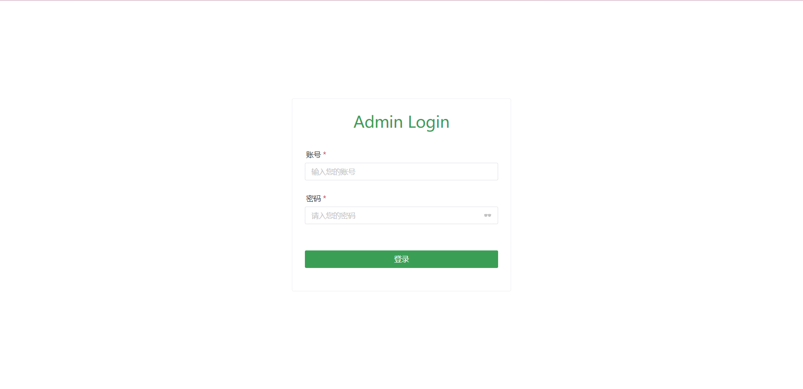
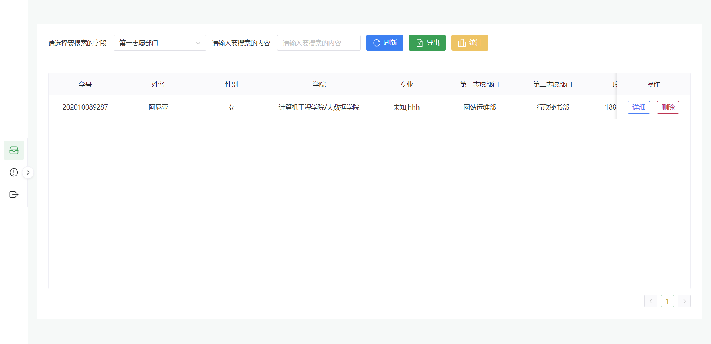
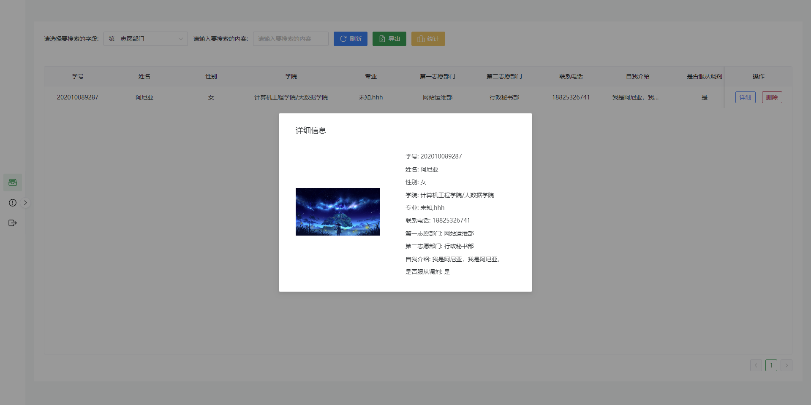
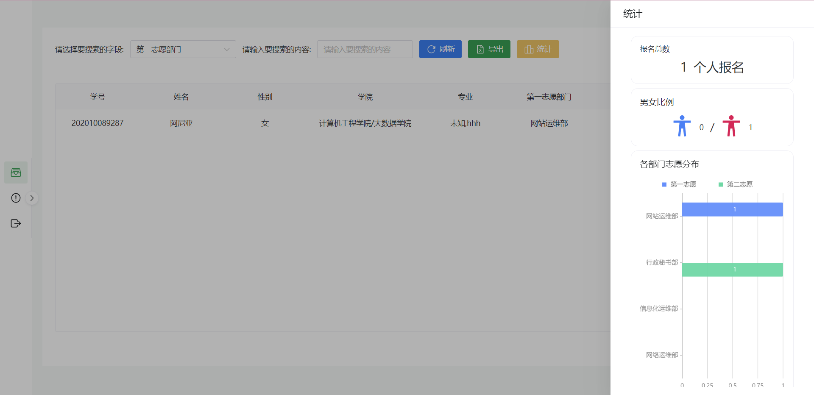
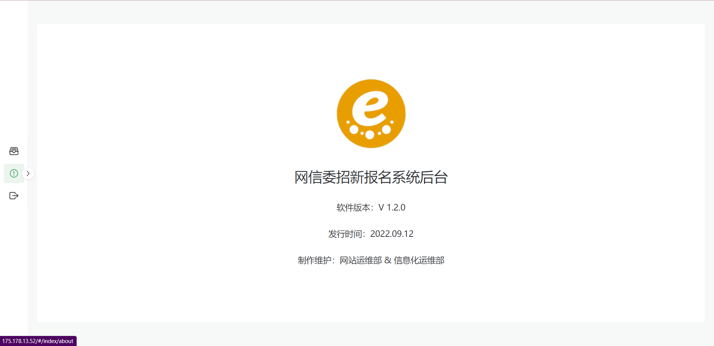

# sign-up-admin
[中文版本](./../README.md)
## Project Introduction
"GCUWOMD Recruitment System Background" is a new student registration background information display system produced by the Student Network and Information Work Committee of Guangzhou City Institute of Technology. It is based on the Vue 3 + TypeScript + Vite + Naive UI implementation. In this system, you can complete operations such as viewing registration information (including personal photos, etc.), deleting registration information, querying personal information, exporting Excel, etc. The system also integrates statistical functions for some of the key indicators, such as: the ratio of men to women, the total number of applicants, and the distribution of volunteers in various departments. This system is a cooperation project between the website operation and maintenance department and the information operation and maintenance department.
## Get started quickly
```shell
# Clone the project
git clone git@github.com:gcuwomd/sign-up-admin.git

# Go to the project directory
cd sign-up-admin

# Install dependencies
pnpm i

# Run the project
pnpm dev

# Build the project
pnpm build
```
## Online preview

## Use
### Login

### Index

### Detail page

### Statistics

### About

## Changelog
- Add a table of application distributions for each department
- Fixed the deletion of registration information bug
- Optimize the interactive experience for search
## Thank

[广州城市理工学院网络与信息中心](https://nc.gcu.edu.cn/)

## Maintainer
[](https://github.com/Peng-Hello)
[@Peng-Hello](https://github.com/Peng-Hello)

## License to Use
[Apache-2.0 license](LICENSE)